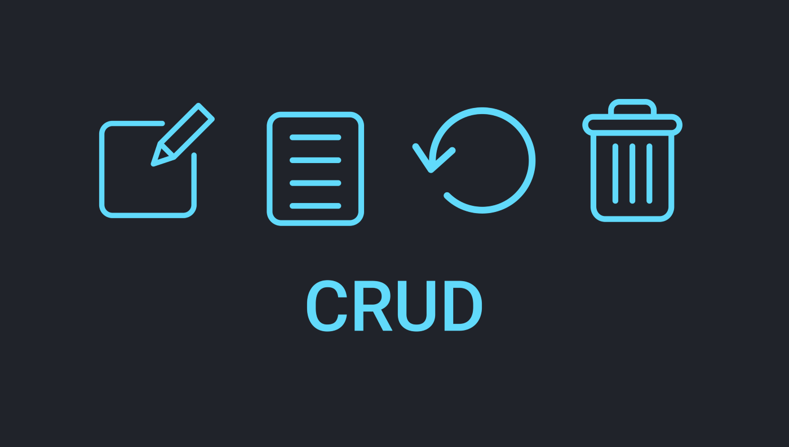
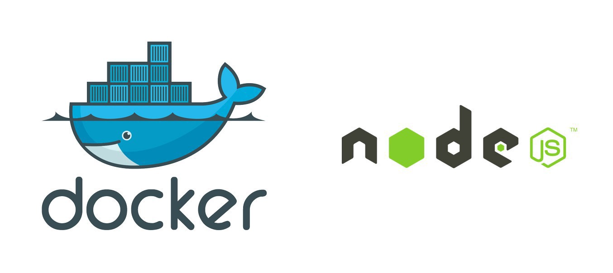
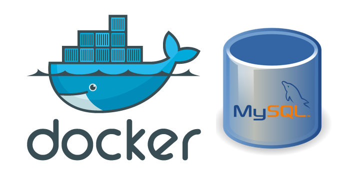
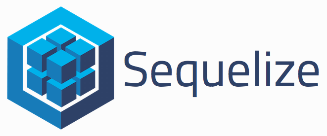

## Projeto: Criar uma Aplicação(API) Back-End (CRUD) e Conectar ao Front-End- seguindo as métricas de engenharia de software (MSC):

### o que é uma API?
> Uma API é um conjunto de rotinas, protocolos e ferramentas para construir aplicações.
> [Fonte: Stack OverFlow ](https://pt.stackoverflow.com/questions/86399/qual-a-diferen%C3%A7a-entre-endpoint-e-api);


### O que um CRUD?
> Nas manipulações de registros realizadas diretamente em banco de dados ou em plataformas
> desenvolvidas no padrão RESTful, o conceito CRUD estabelece o modelo correto no manuseio
> desses dados.
> CRUD representa as quatro principais operações realizadas em banco de dados, seja no modelo 
> relacional (SQL) ou não-relacional (NoSQL), facilitando no processamento dos dados e na 
> consistência e integridade das informações.  
> [Fonte de Informação: Blog byTrybe ](https://blog.betrybe.com/tecnologia/crud-operacoes-basicas/);


### 1 - Setup inicial da aplicação:

- [x] Criando uma Pastas crud-back-front;

```console
mkdir crud-back-front
```

- [x] - Entrando na pasta;

```console
cd crud-back-front
```
- [x] - Criar um arquivo README.md;

```console
touch README.md
```

- [x] - criar uma arquivo .gitignore e colocar corpo do arquivo node_modules, env. como arquivo e pasta a ser ignorada; 

```console
touch .gitignore
```

> Dentro do Arquivo no corpo colocar: node_modules/
> Dentro do Arquivo: .env

- [x] Criando uma Pastas back-end;

```console
mkdir back-end
```

- [x] - Entrando na pasta;

```console
cd back-end
```


- [x] - criar arquivo json padrão;

  ```console
    npm init -y
  ```

- [x] Criando uma Pastas src;

```console
mkdir src
```

- [x] - Executar o comando de inicialização do git localmente na RAIZ do Projeto crud-back-front ;

```console
git init
```

- [x] - Criar um repositório remoto no github;
  
```text
tonistorres/crud-back-front

``` 
- [x] - Lincar o Repositório remoto ao repositório local; 

```text
git remote add origin xpto.git
```

- [x] - Na pasta back-end onde se encontra o arquivo package.json instalar  "git-commit-msg-linter";

```console
npm i git-commit-msg-linter -D
```
> Observacão: Significado das tags relacionadas ao commit-msg-linter

```console
type:
    feat     Adição de funcionalidade.
    fix      Correção de defeito.
    docs     Mudança em documentação.
    style    Mudança de formatação ou estilo, que não afeta a execução do código (espaço, tabulação, etc).
    refactor Mudança na organização do código, que não afeta o comportamento existente.
    test     Adição ou mudança de um teste.
    chore    Adição ou mudança em script de build, que não afeta o código de produção.
    perf     Mudança de código para melhoria de desempenho.
    ci       Mudança de configuração de integração contínua.
    build    Mudança em arquivos de build ou em dependências externas.
    temp     Commit temporário, que não deve ser incluído no CHANGELOG.

  scope:
    Opcional, pode ser qualquer coisa que especifique o escopo da mudança.
    Exemplos: subpacote, workspace, módulo, componente, página.

  subject:
    Breve resumo da mudança, escrito no tempo verbal presente. Começa com letra minúscula e não há ponto final.
```

- [x] - Criar uma branch tonis-torres-back-front;

```console
git checkout -b tonis-torres-back-front;
```
> Alguns comandos git util no desenvolvimento:

```console
git status
git add .
git commit -m""
git push
git push -u origin nome_branch
git pull
git log 
git log --oneline
git tag "nome_tag" -m"" 
git tag -a "nome_tag" -m"" id
```


### 2 - Ferramentas e pacotes que utilizaremos no desenvolvimento da aplicação:

- [x] - FrameWork Express ;
- [x] - nodemom;
- [x] - Mysql;
- [x] - MySQL Workbench (Ferramenta Gráfica);
- [x] - Client que faz a conexão do Node com o Mysql (msql2); 
- [x] - body-parse;
- [x] - mocha ^9.2.2;
- [x] - chai: ^4.3.6; 
- [x] - sinon: ^13.0.1
  

### 3 - Instalando Dependências:

> Todos os comando abaixo deverão ser utilizado dentro da pasta back-end.

- [x] - npm install -D nodemon;
- [Link Pacote npm Nodemon ](https://duckduckgo.com)

  > Obs.: O D MAIÚSCULO é informa que é uma forma contraída de dizer que é uma Dependência de 
  > Desenvolvimento, ou seja, na hora de subir para a produção essa dependência não tem importancia para 
  > o bom funcionamento da minha aplicação, essa dependencia é somente para testes no momento do 
  > desenvolvimento.
 
- [x] - npm i express;
- [Link Express ](https://www.npmjs.com/package/express)


- [x] - npm install sequelize-cli;
- [Link Pacote npm Sequelize-Cli ](https://www.npmjs.com/package/sequelize-cli)

- [x] - npm i sequelize;
- [Link Sequelize ](https://www.npmjs.com/package/sequelize)

- [x] - npm i cors;
- [Link Cors ](https://www.npmjs.com/package/cors)
> o cors ele não é dependência de desenvolvimento, pois, em ambiente de produção ele deve constar na aplicação para fazer a conexão entre back e front.


- [x] - npm install mysql2
 > Client Utilizado para fazer a conexão de uma palicação Node Com Mysql (connector);

- [x] - npm i dotenv
 - [Link dotEnv ](https://www.npmjs.com/package/dotenv)

- [x] - npm i body-parser
  > Middleware de análise do corpo do Node.js.
  > Analise os corpos de solicitação de entrada em um middleware antes de seus manipuladores,
  > disponíveis na propriedade req.body.
- [Body-Parse](https://www.npmjs.com/package/body-parser)

- [x] - npm i http-status-codes (OPCIONAL)
  > códigos de status http constantes enumerando os códigos de status HTTP.
  > Baseado na API Java Apache HttpStatus.
  - [status-codes](https://www.npmjs.com/package/http-status-codes)
  
- [x] - npm install --save-dev chai
- [Link pacote npm Chai](https://www.npmjs.com/package/chai)

- [x] - npm install --save-dev mocha
- [Link pacote npm Mocha](https://www.npmjs.com/package/mocha)

- [x] - npm i --save-dev sinon 
- [Link Pacote npm Sinon](https://www.npmjs.com/package/sinon)

### 4 - Package.json, configurações back-end (Sripts):
 > Configurando o scrip que inicializar nossa aplicação, o arquivo principal da nossa aplicação será server.js

 ```javascritp
"scripts": {
    "start": "nodemon server.js"
  },
 ```

### 5 - Criando a estrutura de pastas (Projeto):

```console

|back-end|
    |
    |---------> |node_modules|
    |
    |---------> |src| 
                  |
                  |-------->|controllers|
                  |
                  |-------->|services|
                  |
                  |-------->|middlewares|
                  |
                  |-------->|routes|
                  |
                  |--------> utils
|front-end|                  
     |
     |---------> |node_modules|
     |
     |---------> |public|
     |
     |---------> |src| 

```         

### 6 - Configurando ambiente do Front-End:

- [x] Criando uma Pasta front-end;

```console
mkdir front-end
```

- [x] - Entrando na pasta;

```console
cd front-end
```

- [x] - Rodando o comando de criacao da pasta de trabalho;

```console
npx create-react-app app-reservas
```



### 7 - Dockerizando aplicação:

> Para aplicação ficar mais completa iremos trabalhar com micro serviços (docker), inicialmente iremos dockerizar o mysql e o NodeJS

```yml
version: '3.1'
# inicialmente teremos 02(dois) microserviços trabalhando conjuntamente o mysql e o nodeJS (API - Back-End) 
services:

# 1º serviço mysql
  mysql:  
  # baixar a imagem do mysql 5.7 no docker hub
      image: mysql:5.7
      # da um nome para o nosso container mysql
      container_name: container-mysql
      # configurar nossa vairável de ambiente 
      environment:
        - MYSQL_ROOT_PASSWORD=xxxx
      ports:
      # rodar na porta 3308 na  minha maquina e 3306 no container
        - 3308:3306  

  # 2º serviço      
  api:
  # Baixar a última versão do node tag (latest)
    image: node:latest
    # vamos nomear o container como container-api
    container_name: container-api
    # restartar automaticamente a aplicação 
    restart: always
    # configurando a porta onde vai rodar api dentro do container docker
    ports:
    # rodar na porta 3001 na  minha maquina e 3001 no container
      - 3001:3001
    # configurando as variaveis de ambiente do mysql  
    environment:
        - DB_HOST=mysql
        - DB_NAME=dbreservas
        - DB_USER=root
        - DB_PASSWORD=1020
        - SERVER_PORT:3001
    # Fazendo um bind entre minha pasta back-end e usr/app dentro do meu container node    
    volumes:
      - ./back-end:/usr/app
    # setando meu diretório de trabalho onde será refletido as mudanças feitas na pasta back-end  
    working_dir: /usr/app
    # por fim vamos rodar o comando npm install e npm start para instalar as dependencias do meu projeto 
    # dentro do container e por fim inicializar minha aplicação back-end
    command: bash -c "npm install && npm start"            
```




### 8 - Sequelize:


#### O que é ORM (Sequelize)?

> O Sequelize é um ORM (Object-Relational Mapper)
> para Node.js, que tem suporte aos bancos de dados
> PostgreSQL, MariaDB, MySQL, SQLite e MSSQL, como 
> ORM ele faz o mapeamento de dados relacionais 
> (tabelas, colunas e linhas) para objetos 
> Javascript.

[Fonte: Blog Rocketseat ](https://blog.rocketseat.com.br/nodejs-express-sequelize/);

#### Criando estruturas de pastas do ORM (Sequelize) no projeto:
```console


```
## Iniciando os trabalhos com Sequelize 

1 - iniciando um projeto com Sequelize

- [x]  npx sequelize-cli init

```console
Esse comando irá criar as seguintes pastas:
config : contém um arquivo de configuração, com orientações para o CLI se conectar com o nosso banco de dados;
models : contém todos os modelos da nossa aplicação;
migrations : contém todos os arquivos de migração da nossa aplicação;
seeders : contém todos os arquivos de "seeds" (sementes que são usadas para popular o banco).
```
2 - vamos instalar a biblioteca dotenv para trabalharmos com variáveis de ambiente 
- [x]  npm i dotenv

3 - agora iremos criar arquivo .gitignore e definiar que não iremos subir para o github o .env e node_modules/  
- [x]  .gitignore

4 - Entrar no arquivo config.json e configurar as chaves que fazer acesso ao seu banco de dados mysql

```console
{
  "development": {
    "username": "root",
    "password": "",
    "database": "orm_example",
    "host": "127.0.0.1",
    "dialect": "mysql"
  }

```

> OBSERVAÇÃO: adicionar o a pasta config/config.json ao .gitignore para que informações sensívei não subam para o 
> github.


5 - Criando o banco de dados já predefinido no arquivo config.json 
- [x]  npx sequelize db:create

```console
Loaded configuration file "config/config.json".
Using environment "development".
Database dbuser created.
```

6 - verirfique no seu CLI Mysql se o banco foi criado

```console

Execute o comando no terminal:
mysql -u root -p

coloque sua senha de acesso ao mysql: 
passord: xxxx

Dentro do banco execute  o comando abaixo para listar todas db:
show databases;

```

7 - Criando uma tabela User dentro de (model) com um atributo por nome fullName e 
uma migration com uma copia da tabela criada:

```console
npx sequelize model:generate --name User --attributes fullName:string
```
#### Observação:
> O arquivo user.js criado na pasta (model) está mapeando a tabela utilizando classe,
> ou seja, usando POO (Paradigma da Orientação Objeto), porém, nesse momento estamos 
> usando programação funcioal daí iremo converter todo conteúdo criando em classe para 
> função.

8 - Para executarmos um migrations de forma ela executar uma operação no banco de dados 
utilizamos o CLI Sequelize instalados com o abaixo explicitado que ela irá fazer alterações 
na tabela do banco de dados setando no arquivo config.json

```console 
    npx sequelize db:migrate
```

9 - Caso queira reverter uma migrations utilize o comando abaixo: 

```console 
npx sequelize db:migrate:undo
```

10 - Criar uma migrations para adicionarmos um campo numa tabel já criada:

```console 
npx sequelize migration:generate --name add-column-phone-table-users
```
##### O corpo da migrations ficará da seguinte forma:

```javascript 

'use strict';

module.exports = {
  up: async (queryInterface, Sequelize) => {
    await queryInterface.addColumn('Users', 'phone_num', {
      type: Sequelize.STRING,
    });
   },
 
   down: async (queryInterface, Sequelize) => {
     await queryInterface.removeColumn('Users', 'phone_num');
   }
};

```

